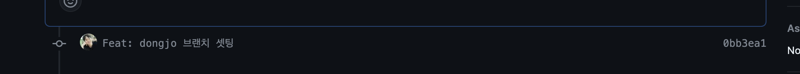
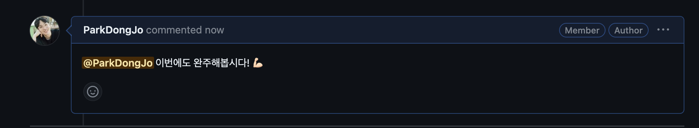
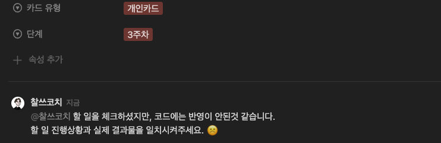
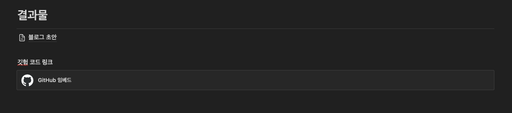

# 스터디캠프 - 함수형 프로그래밍 스터디 1기 2번째 강의 프로젝트
함수형 프로그래밍 과정 중에서 인프런의 유인동 강사의 강의를 듣고 예제 코드를 따라 작성하고 코드를 올리는 레포지토리 입니다. 아래의 강의들을 학습해 나갑니다. 

- 함수형 프로그래밍과 JavaScript ES6+ 응용편 학습

 
 

### 과제제출
-------
과제 제출은 아래와 같이 진행합니다.

1. 자신의 브랜치를 main 브랜치로 merge 하는 PR을 날려둡니다.

 
 

2. 작업 후 커밋을 자신의 origin 브랜치에 올립니다.

 
 

3. 코치와 참가자가 코멘트로 소통합니다.

 
 

4. 작업카드 관련 소통은 노션 카드로 합니다.

